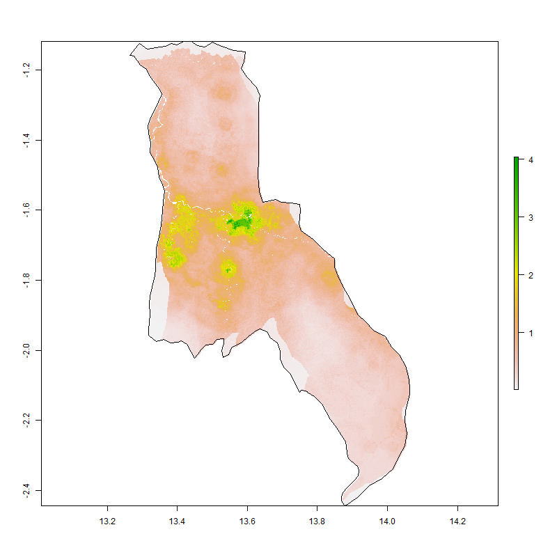
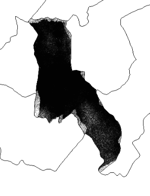
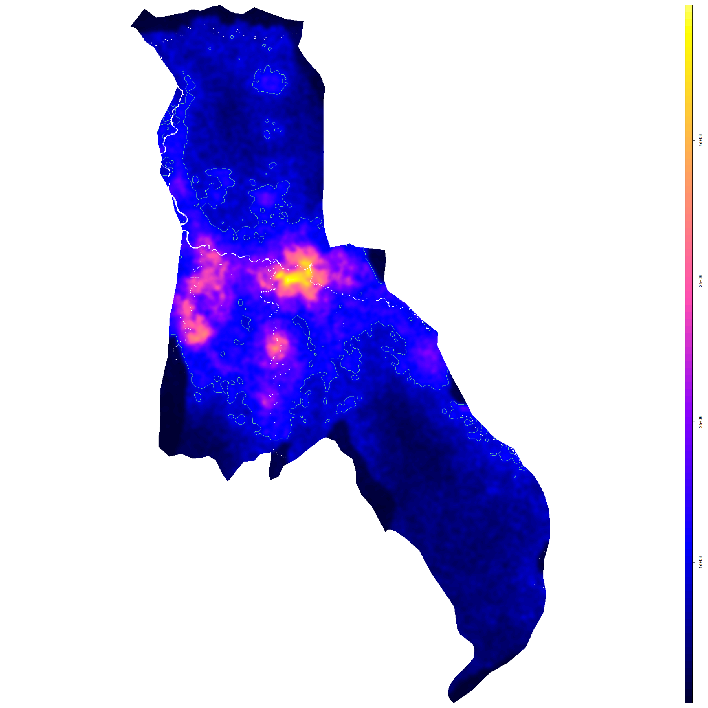
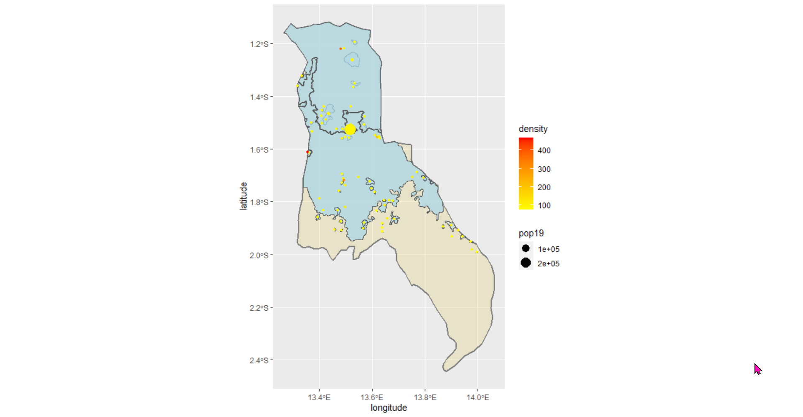

# Accessibility 1: Mpassa, Gabon

This is the subset raster plot of the Mpassa adm2 of the country of Gabon created from the Worldpop ppp file.

This is a plot that represents people as individual dots.  This is not a great representation perhaps due to a high density or artifacts in the provided data.

This is a population density plot of Mpassa with multiline objects surrounding urban areas.  PLEASE NOTE: the multiline objects are indeed present in the image, they are just very thin and subtle.

# Project Deliverable
This is a plot showing urbanized areas in Mpassa.

