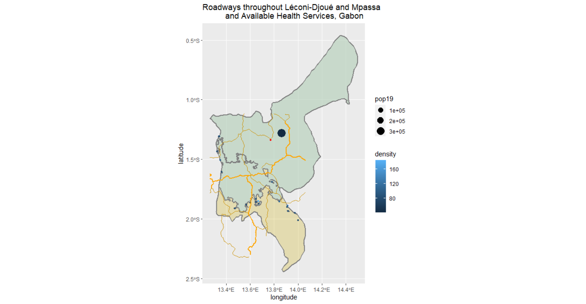

## Accessibility 1: Mpassa, Gabon

This is the subset raster plot of the Mpassa adm2 of the country of Gabon created from the Worldpop ppp file.

# Dot Plot
This is a plot that represents people as individual dots.  This is not a great representation perhaps due to a high density or artifacts in the provided data.

# Multiline Plot
This is a population density plot of Mpassa with multiline objects surrounding urban areas.  PLEASE NOTE: the multiline objects are indeed present in the image, they are just very thin and subtle.

# Project Deliverable
This is a plot showing urbanized areas in Mpassa.

# Roads & Density
Analysis:  Of the two combined adm2 districts, there are approximately 18 urban areas.  There are approximately 468,000 individuals in this combination with a split of 382,000 (Mpassa) and 86,000 (Léconi-Djoué).  The urban areas are characterized by many urban areas that are primarily low in density. Urban areas tend to focus in the center of the adms2.
Roads seem to be available to major urban areas and follow the middle of the districts.
These two adms are in dire need of more health services.  Using data from OpenStreetMap, only one doctor is available to the region out of 170 clinics, 2 dentists, 7 doctors, 22 hospitals, and 100 pharmacies in the country.  The doctor is denoted by the single red dot.

