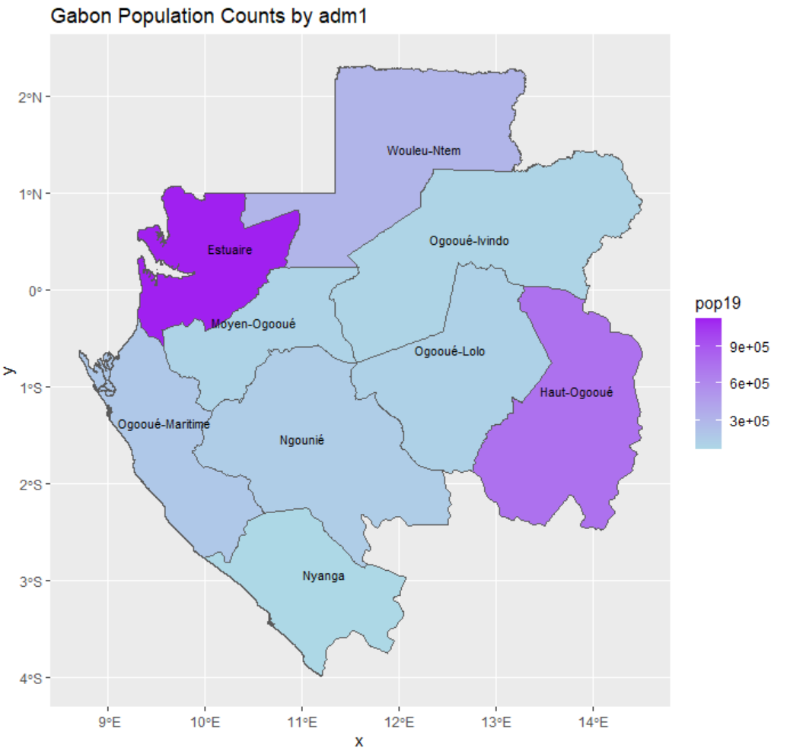
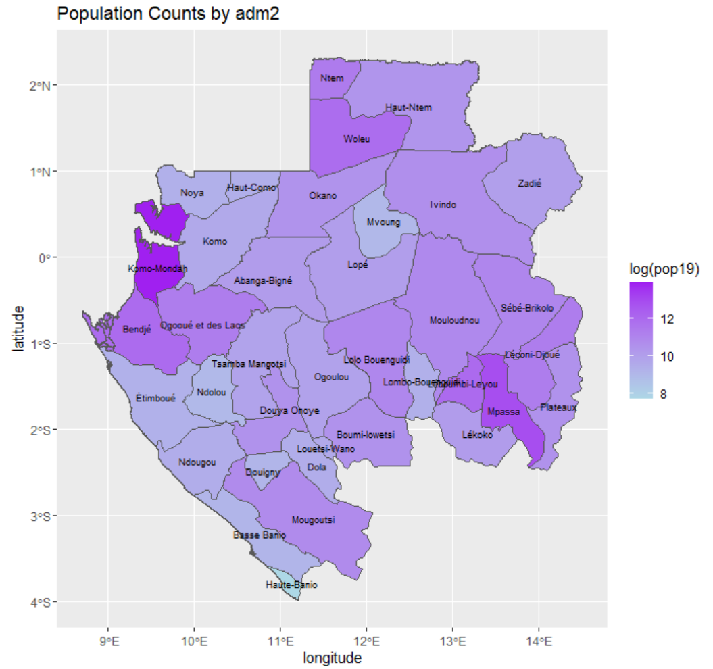
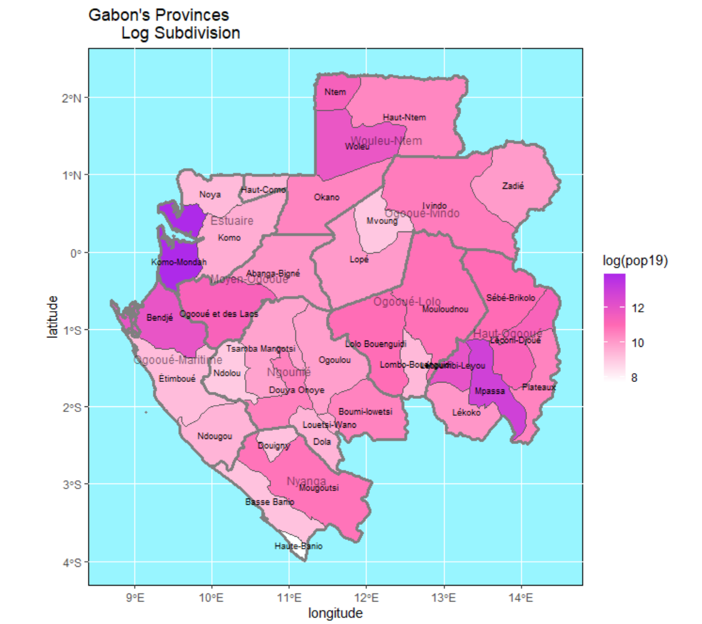

# Challenge Problem
This is my map of Gabon showing the approximate population counts for each province.

# Stretch Goal 1
This is Gabon subdivided into adm2 with a log scale applied to population counts.

# Stretch Goal 2
This is the same plot as above but with the border of adm1 and the names of the provinces added.  White is low, pink is medium, and purple is high.

