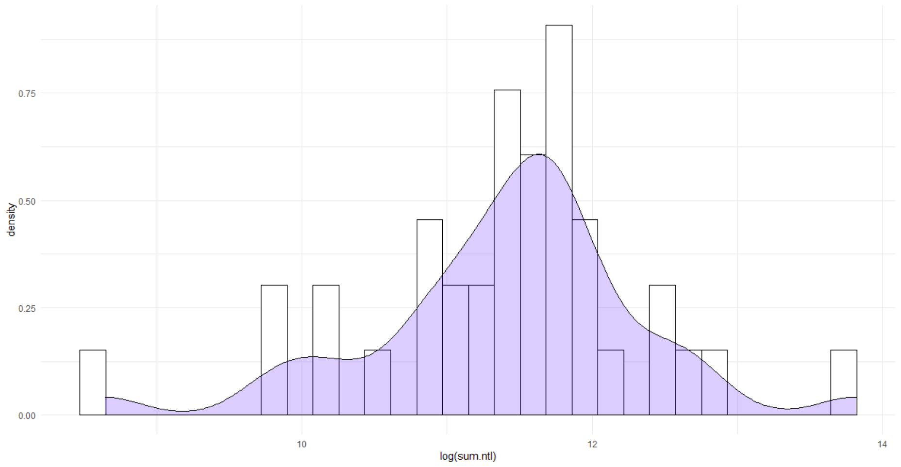
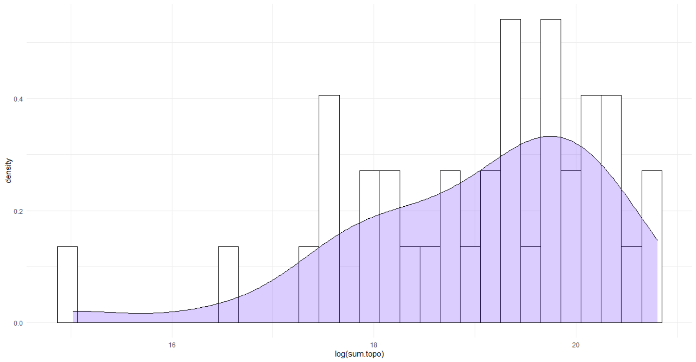
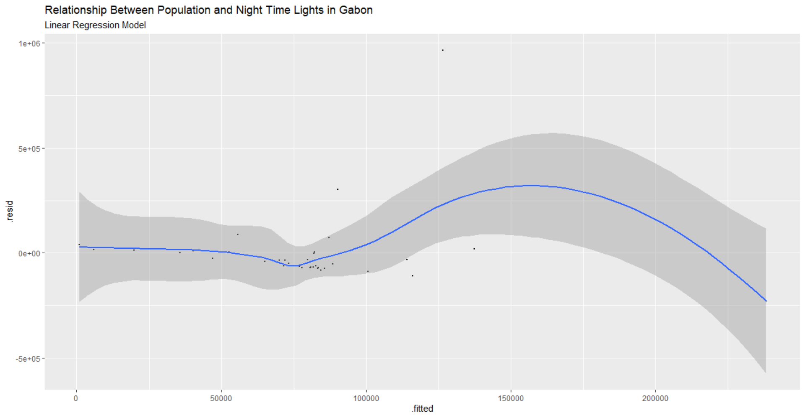

# Challenge Problem

## Histograms

This plot illustrates a histogram relating population density and night time lights in Gabon.

This plot illustrates a histogram relating population density and topography in Gabon.

## Linear Regressions

This plot illustrates a linear regression relating population and night time lights in Gabon.

This plot illustrates a linear regression relating population and topography in Gabon.

