# Challenge Problem
These are my two "mapviews" of the country of Gabon.  The first graph shows the adm1 subset and the second shows the adm2 subset.

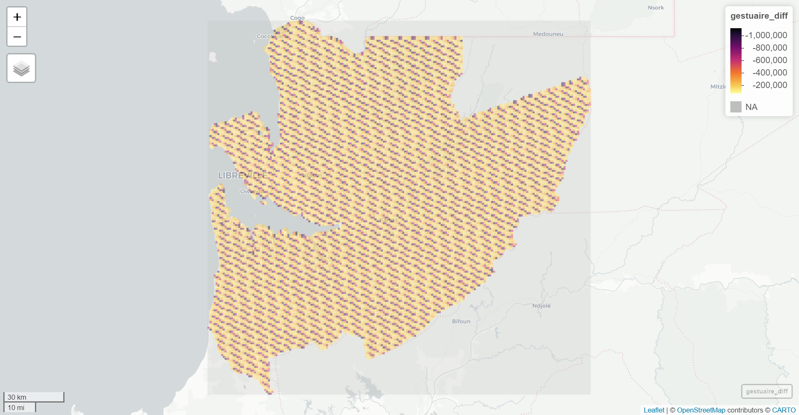

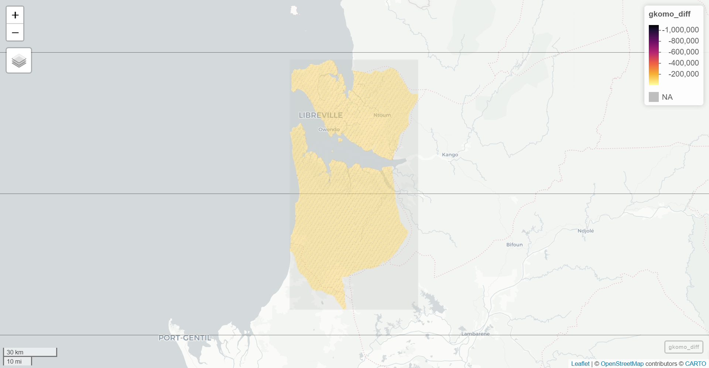

# Sum Investigation & Comparison
This are the three maps that show the analysis of the summing of the adm2 layer.

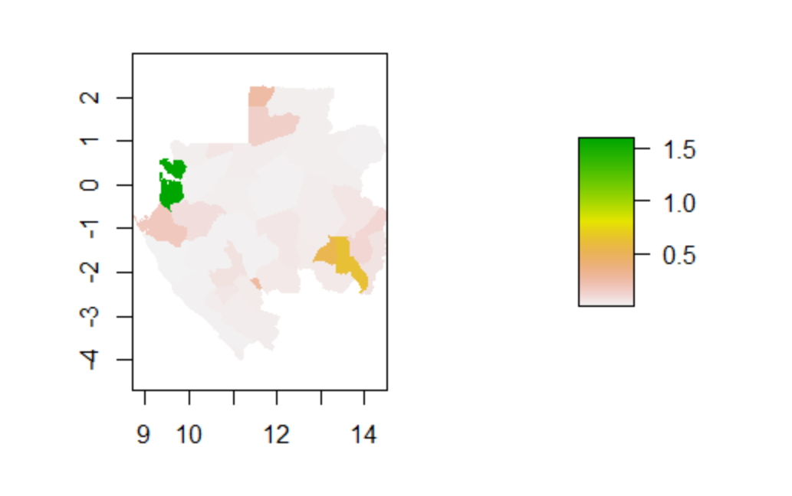

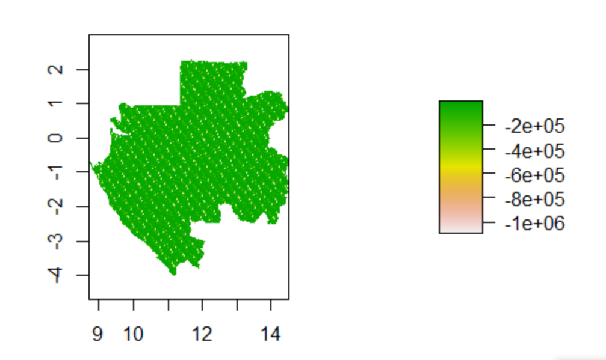

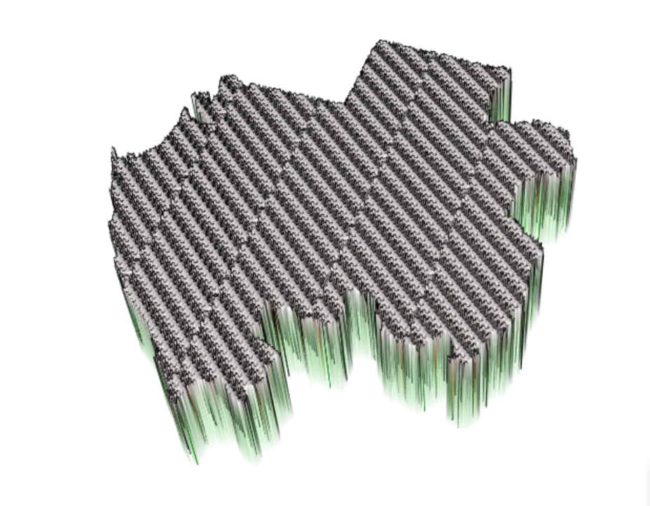

# Mean Investigation & Comparison
This are the three maps that show the analysis of the means of the adm2 layer.

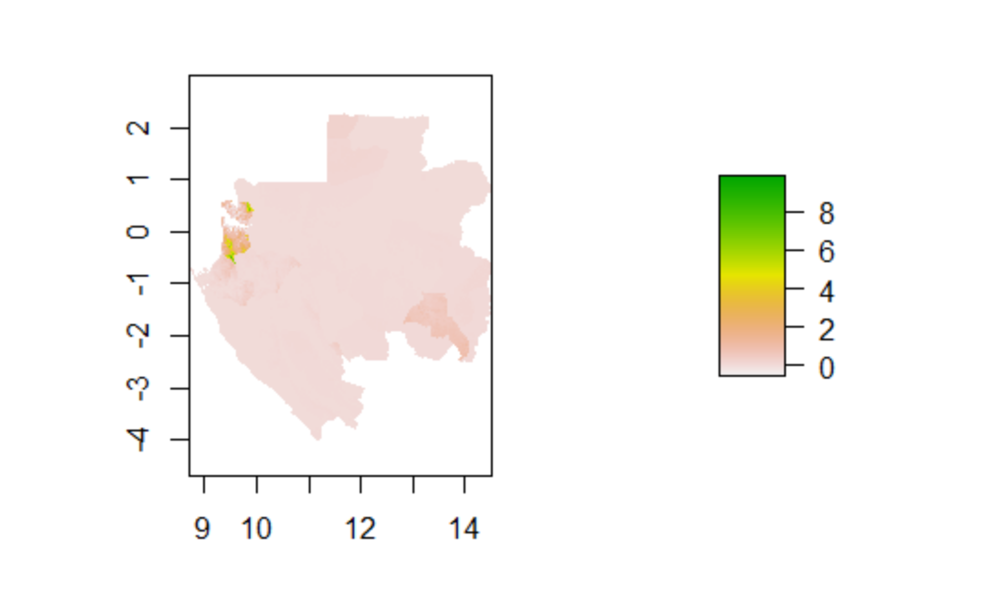

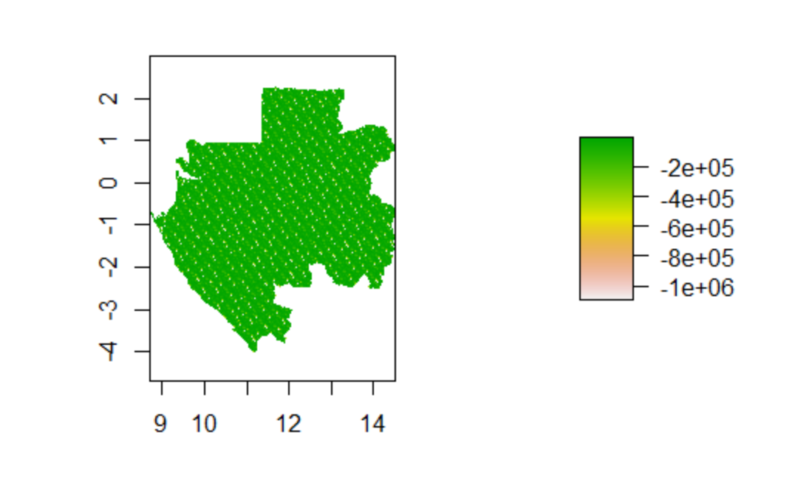

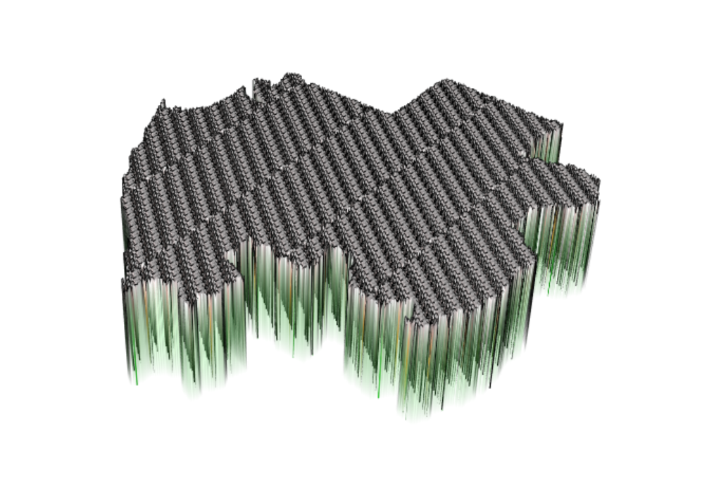

# LogPop Investigation & Comparison
This are the three maps that show the analysis of the logarithm of the populations of the adm2 layer.

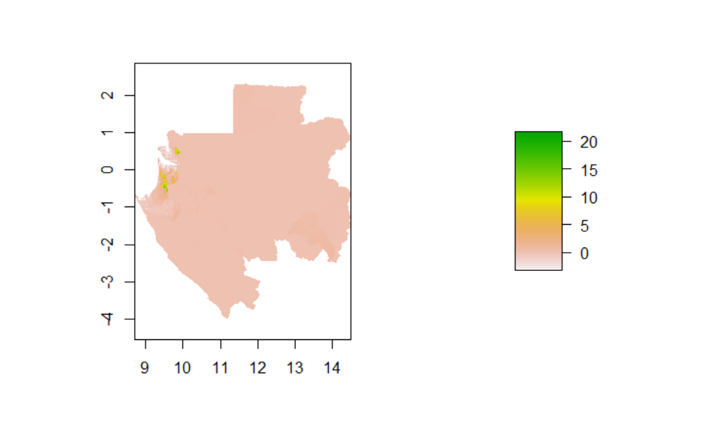

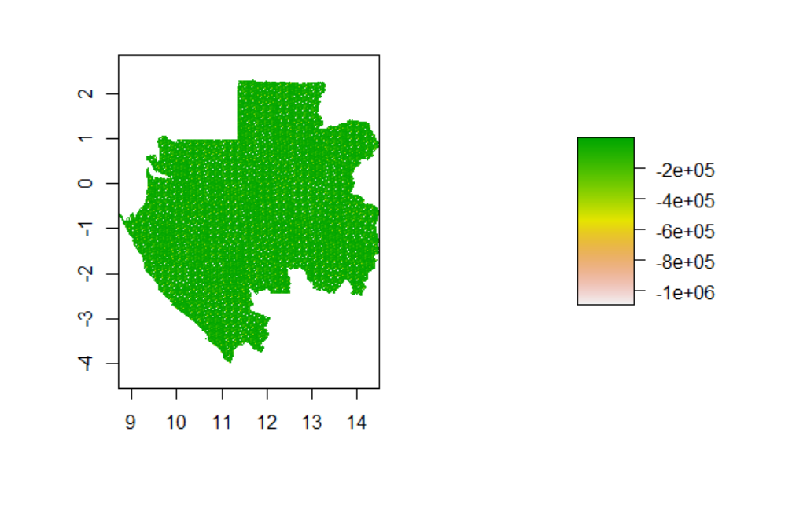

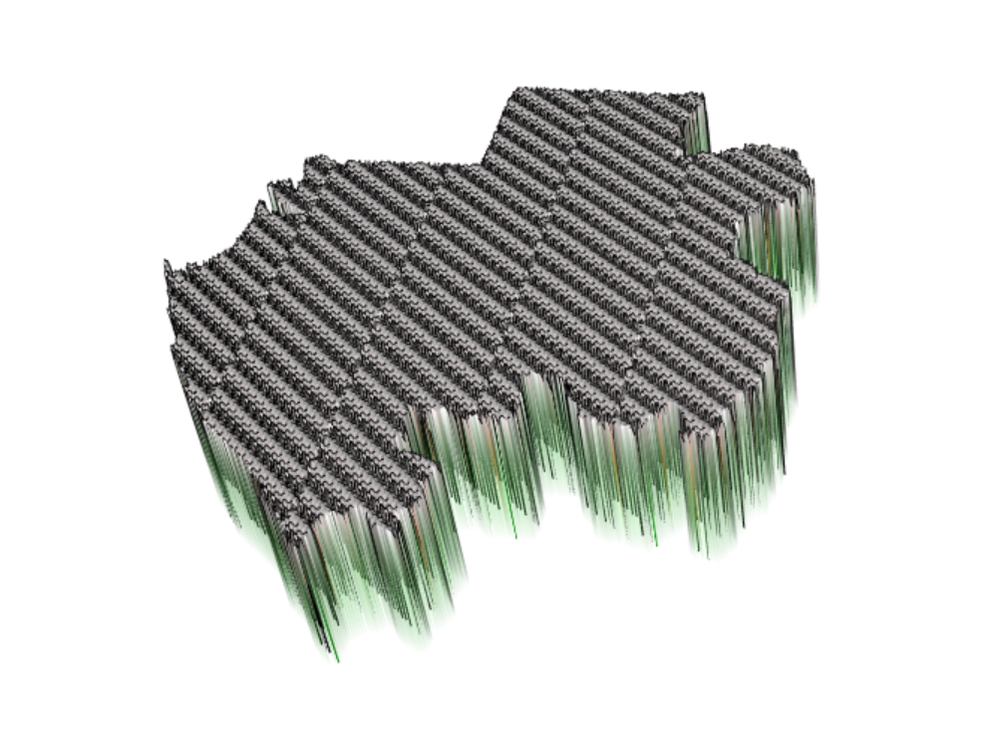
